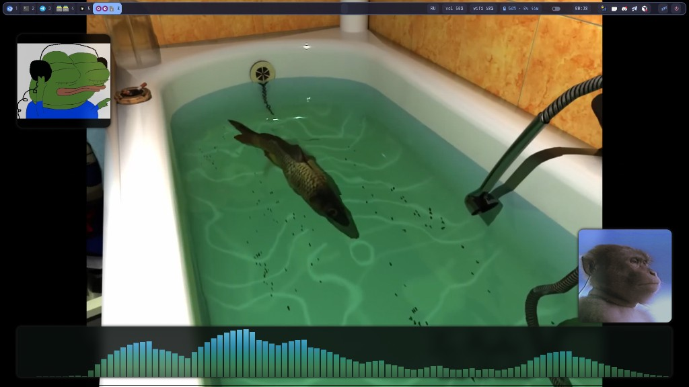

# hyprland-config

Полный набор dotfiles для **Arch Linux / Manjaro** и **Hyprland**: Hypr, Waybar, Mako, SwayOSD, music lounge, imv, PipeWire/WirePlumber, буфер обмена и утилиты.

**Автор:** [@MrTapocheck](https://github.com/MrTapocheck)

## Music lounge (Super+8)

Видеофон, GIF-виджеты и визуализатор cava — отдельный workspace для прослушивания музыки.



*Super+8: mpvpaper-фон, Pepe и monkey GIF, cava внизу. Waybar по двойному Super.*

## Быстрая установка (новая система)

```bash
sudo pacman -S --needed git base-devel
git clone https://github.com/MrTapocheck/hyprland-config.git ~/hyprland-config
cd ~/hyprland-config
./install.sh
```

Скрипт `install.sh`:

- ставит пакеты из `packages.txt` через `pacman` (флаг `--skip-packages`, если пакеты уже стоят);
- создаёт симлинки `config/*` → `~/.config/*` (существующие каталоги сохраняются как `*.bak.YYYYMMDDhhmmss`);
- кладёт `imv-dir.desktop` в `~/.local/share/applications/`;
- подмешивает ассоциации изображений в `~/.config/mimeapps.list`;
- копирует `network.local.sh` из примера, если файла ещё нет;
- делает исполняемыми все `*.sh` в `config/hypr/`;
- создаёт `~/Pictures/wallpapers/`;
- ставит симлинки медиа music lounge (`assets/music-lounge/` → `~/Videos/`).

После установки **обязательно**:

1. Отредактируйте `~/.config/hypr/network.local.sh` — имена Wi‑Fi из `nmcli connection show`.
2. Проверьте мониторы в `~/.config/hypr/hyprland.conf` (`HDMI-A-1`, `eDP-1` и т.д.).
3. Положите обои в `~/Pictures/wallpapers/` (`wall1.jpeg` … — как в `hyprpaper.conf` / `hyprlock.conf`).
4. Перезайдите в Hyprland или выполните `hyprctl reload`.

## Структура репозитория

```
hyprland-config/
├── README.md
├── LICENSE
├── install.sh
├── packages.txt
├── assets/
│   ├── music-lounge/      # фон ws 8: bg.mp4 + GIF-виджеты
│   └── screenshots/       # превью для README
├── config/
│   ├── hypr/              # hyprland.conf, скрипты, hyprlock, music lounge
│   ├── waybar/
│   ├── mako/
│   ├── swayosd/
│   ├── cava/              # music-lounge.conf + shaders/themes
│   ├── rofi/
│   ├── cliphist/
│   └── wireplumber/wireplumber.conf.d/
└── extra/
    ├── applications/imv-dir.desktop
    └── mimeapps.d/hyprland-config.mimeapps
```

## Локальные файлы (не в git)

| Файл | Назначение |
|------|------------|
| `config/hypr/network.local.sh` | Wi‑Fi и прочие личные параметры сети |
| `*.state`, `*.restore` | runtime-состояние скриптов |
| `obs-venv/` | локальное venv для OBS (если есть) |

Шаблон сети: `config/hypr/network.local.sh.example`.

## Аудио (PipeWire / WirePlumber)

В репозитории:

- `config/wireplumber/wireplumber.conf.d/51-auto-audio.conf` — **общее** правило приоритета USB-ЦАП;
- `51-auto-audio.conf.example` — пример с **PCI id** встроенной звуковой карты ноутбука (`alsa_card.pci-0000_…`) для auto-profile / auto-port.

Скопируйте и отредактируйте под своё железо:

```bash
cp ~/.config/wireplumber/wireplumber.conf.d/51-auto-audio.conf.example \
   ~/.config/wireplumber/wireplumber.conf.d/51-auto-audio.conf
# замените pci-0000_03_00.6 на свой id (wpctl status / pactl list cards short)
systemctl --user restart wireplumber
```

Скрипт `config/hypr/audio-setup.sh` содержит константы `LAPTOP_CARD` / sink под конкретную машину — при переносе на другой ПК их нужно поправить.

## Рабочие столы

| Клавиша | Workspace | Содержимое |
|---------|-----------|------------|
| Super+1…7 | 1–7 | Приложения (Chromium, Yakuake, Telegram, Thunar…) |
| Super+8 | 8 | Music lounge (фон, cava, виджеты) |
| Super+9 | 9 | imv — просмотр фото |
| Super+0 | 10 | Запасной |

## Полезные скрипты (`config/hypr/`)

| Скрипт | Описание |
|--------|----------|
| `music-lounge.sh` | Демон music lounge на ws 8 |
| `imv-open.sh` / `imv-menu.sh` | Просмотр папок и меню imv |
| `audio-setup.sh` | Выбор sink при смене устройств |
| `network-start.sh` | NetworkManager + Wi‑Fi после входа |
| `clipboard-panel.sh` | История буфера (Super+V) |
| `volume-osd.sh` / `brightness-osd.sh` | OSD через SwayOSD |
| `boot-fix-network.sh` | Одноразовая настройка NM (sudo) |

## Music lounge — детали

В репозитории уже лежат медиа для восьмого workspace:

| Файл | Назначение |
|------|------------|
| `assets/music-lounge/bg.mp4` | Зацикленный фон (~5 мин, без звука) |
| `assets/music-lounge/widget-left.gif` | Виджет слева |
| `assets/music-lounge/widget-right.gif` | Виджет справа |
| `config/cava/music-lounge.conf` | Визуализатор cava (SDL, зелёный → голубой) |

`install.sh` создаёт симлинки:

- `~/Videos/music-lounge-bg.mp4` → `bg.mp4`
- `~/Videos/music-lounge/widget-*.gif` → GIF из репо

Переменные — `config/hypr/music-lounge.env`. Для видеофона через **mpvpaper** (слой обоев, не перекрывает waybar):

```bash
~/.config/hypr/music-lounge-install-mpvpaper.sh
```

Запуск: **Super+8** или `music-lounge-goto.sh`.

## Suspend и крышка ноутбука

На Ryzen + amdgpu **s2idle зависает**; рабочий режим — **deep (S3)**. Крышка и кнопка сна waybar идут одним путём: `systemctl suspend` + hypridle (по [wiki](https://wiki.hypr.land/Hypr-Ecosystem/hypridle/)).

Однократно (sudo), затем **перезагрузка** (не `restart systemd-logind` в сессии!):

```bash
cd ~/hyprland-config
sudo ./install-lid-safe.sh
sudo reboot
```

После перезагрузки:
- **Крышка закрыта** / **кнопка сна waybar** / **Super+Shift+Z** → suspend (deep)
- **Крышка открыта** → пробуждение, `after-sleep.sh` включает экран
- **20 мин бездействия** (hypridle) → lock + экран off, без suspend

`lactd` отключается при install — мешал amdgpu при suspend.

## imv

Ассоциации типов `image/*` → `imv-dir.desktop` добавляет `install.sh`. Открытие каталога: Super+9 или контекстное «Открыть с помощью».

## Обновление dotfiles

```bash
cd ~/hyprland-config
git pull
./install.sh --skip-packages
hyprctl reload
```

## Лицензия

MIT — см. [LICENSE](LICENSE).
